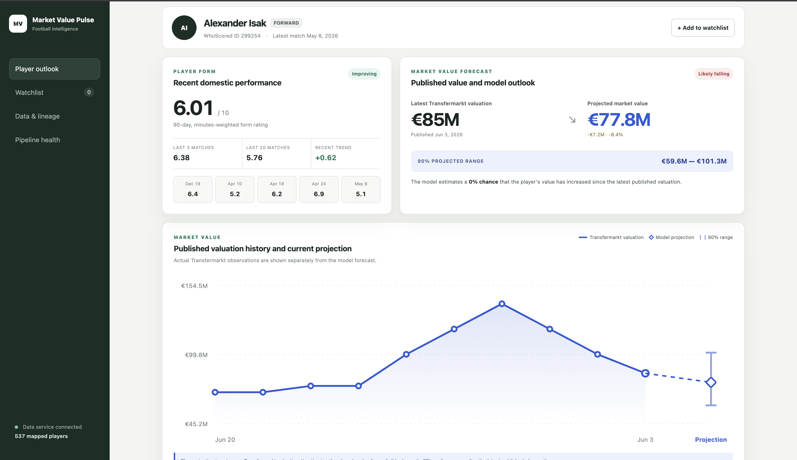

# Market Value Pulse

Market Value Pulse is an incremental football data platform that combines Transfermarkt valuation histories with WhoScored match events, derives player-performance features, produces transparent post-match ratings and projects market-value movement with uncertainty.

The repository is designed for continuous operation. A completed match is the unit of work: raw source data is retained, normalized and feature partitions are idempotent, only new or changed feature partitions are rated, and database writes use stable upsert keys.

## Demo

[](https://drive.google.com/file/d/1B6l6PET1vru9vvueZiZ-8uF2h1N3ej6K/view?usp=drive_link)

Click the image to watch the application walkthrough.

The walkthrough shows the Dockerized stack starting, the player dashboard, recent
performance ratings, valuation history, the projected market value, the 90%
predictive range and the probability of an increase.

## Current implementation

- Responsible WhoScored competition/season discovery, acquisition and normalization
- Transfermarkt roster and historical valuation ingestion and normalization
- Immutable raw runs with manifests, retries and explicit partial/failure states
- Partitioned normalized Parquet tables with schema/range/duplicate validation
- Self-contained Parquet-native inference for xG, xGOT, xA, xT and xPV enrichment
- Native, position-aware `post_match_v2` rating with conservative calibration
- Versioned pass priors, z-score statistics and rating configuration
- Content-hash state for new or changed match detection
- Exponentially weighted, rolling-three and rolling-20 player form state
- Conservative WhoScored-to-Transfermarkt entity resolution and a review queue
- Leakage-safe valuation features, Bayesian model, OLS benchmark and uncertainty ranges
- Idempotent PostgreSQL loading of matches, features, ratings, form and valuations
- FastAPI backed by PostgreSQL in Docker, with a Parquet fallback outside Docker
- Next.js player dashboard connected to the real API
- Chronological replay of the latest eight real matches
- Version-controlled data catalog and lineage metadata

The feature engine, post-match rating, state management and valuation workflow all live in this repository. The five fitted feature-model families are treated as versioned read-only artifacts.

## Architecture and storage lifecycle

The detailed system and incremental-update diagrams are available in
[`docs/architecture.md`](docs/architecture.md).

```text
WhoScored + Transfermarkt
  → immutable raw responses and run manifests
  → validated, partitioned normalized Parquet
  → event enrichment and position-aware player ratings
  → rolling form state and entity resolution
  → valuation training/current scoring
  → API-ready serving Parquet
  → PostgreSQL → FastAPI → Next.js
```

The main application modules are:

```text
src/
├── api/
├── database/
├── features/
├── entity_resolution/
├── ingestion/
├── pipelines/
├── ratings/
├── serving/
├── valuation/
└── cli.py
```
## Quick demonstration

After the prepared data and model artifacts are available, start the complete
stack with one command:

```bash
docker compose up --build
```

Open:

- Dashboard: http://localhost:3000
- API documentation: http://localhost:8000/docs
- API health: http://localhost:8000/health

To reproduce the prepared June 3, 2026 forecast snapshot with the promoted
valuation model:

```bash
TM_NORM="$(
  find data/normalized/transfermarkt/competition=GB1/season=2025 \
    -mindepth 1 -maxdepth 1 -type d \
  | sort | tail -n 1
)"

uv run mvp model build-current-features \
  --competition EPL \
  --season 2025-2026 \
  --as-of-date 2026-06-03 \
  --valuations "$TM_NORM/player_valuations.parquet" \
  --mapping data/normalized/entity_resolution/player_mapping_exact.parquet \
  --ratings data/features/ratings/competition=EPL

uv run mvp model score \
  --model-version active \
  --output data/serving/player_valuation_predictions.parquet

uv run mvp serving build \
  --competition EPL \
  --season 2025-2026 \
  --ratings data/features/ratings/competition=EPL/season=2025-2026/player_match_ratings.parquet \
  --valuations "$TM_NORM/player_valuations.parquet" \
  --mapping data/normalized/entity_resolution/player_mapping_exact.parquet \
  --predictions data/serving/player_valuation_predictions.parquet

uv run mvp database load \
  --competition EPL \
  --season 2025-2026 \
  --ratings data/features/ratings/competition=EPL/season=2025-2026/player_match_ratings.parquet \
  --form-state data/state/ratings/competition=EPL/season=2025-2026/player_form_state.parquet \
  --serving-root data/serving
```

The dashboard then displays the latest published Transfermarkt valuation, the
model midpoint, a 90% predictive range, the probability of an increase, recent
form and match-level performance drivers.

## Setup

Requirements are Python 3.12, `uv`, Node 22 for local frontend development, Docker for the full stack and Chromium for live WhoScored acquisition.

```bash
uv sync --extra dev
uv run playwright install chromium
uv run mvp --help
```

Model training has heavier optional dependencies:

```bash
uv sync --extra dev --extra train
```

To reuse an existing download in a fresh copy of the repository without
copying stale generated outputs:

```bash
scripts/migrate-existing-data.sh \
  "/path/to/old-repository" \
  "/path/to/new-repository" \
  "/path/to/feature-model-artifacts"
```

This copies only `data/raw`, `data/normalized` and the fitted feature
artifacts provided to the new environment. Features, rating state, serving snapshots and replays are rebuilt.

## 1. Acquire the EPL 2025/26 season

The WhoScored command needs only the configured competition and season. Omit the cap on the first backfill:

```bash
uv run mvp whoscored ingest \
  --competition EPL \
  --season 2025-2026 \
  --workers 2 \
  --delay-ms 1500
```

For later scheduled runs, select only the newest missing completed matches:

```bash
uv run mvp whoscored ingest \
  --competition EPL \
  --season 2025-2026 \
  --max-new-matches 8 \
  --workers 2 \
  --delay-ms 1500
```

Existing normalized `_SUCCESS.json` markers and calendar dates are checked before the cap is applied. Re-running the same command therefore skips completed matches, and future fixtures cannot starve the newest eligible match. Live/incomplete matches are retained in raw storage as `deferred_incomplete` and remain eligible for a later run.

Fetch and normalize Transfermarkt:

```bash
uv run mvp transfermarkt ingest \
  --league-config config/leagues/GB1.json \
  --season 2025 \
  --concurrency 3 \
  --requests-per-minute 30 \
  --timeout-seconds 30 \
  --max-retries 4

TM_MANIFEST="$(
  find data/raw/transfermarkt -type f \
    -path '*/competition=GB1/season=2025/manifest.json' \
  | sort | tail -n 1
)"

uv run mvp transfermarkt normalize \
  --run-directory "$(dirname "$TM_MANIFEST")"
```

Acquisition commands display overall progress, elapsed time, ETA, current match and outcome counts. The same progress events are retained as JSONL in each run directory.

## 2. Install the feature-model artifacts

```text
models/features/
├── goal_probability/xpv_action_v1/{metadata.json,model.json}
├── xa/xa_action_v1/{metadata.json,model.joblib}
├── xg/xg_shot_v1/{metadata.json,metadata.joblib,model.joblib}
├── xgot/xgot_shot_v1/{metadata.json,metadata.joblib,model.joblib}
└── xthreat/xt_action_v1/{metadata.json,model.json}
```

```bash
uv run mvp enrichment score-season \
  --competition EPL \
  --season 2025-2026 \
  --max-matches 1 \
  --prepare-only
```

## 3. Materialize features, ratings, serving data and PostgreSQL

Start PostgreSQL and the idempotent schema initializer. This also upgrades an existing Docker volume:

```bash
docker compose up -d postgres db-init
```

Locate the latest normalized Transfermarkt run:

```bash
TM_NORM="$(
  find data/normalized/transfermarkt/competition=GB1/season=2025 \
    -mindepth 1 -maxdepth 1 -type d \
  | sort | tail -n 1
)"
```

Run the stateful pipeline:

```bash
uv run mvp pipeline materialize \
  --competition EPL \
  --season 2025-2026 \
  --as-of-date 2026-05-24 \
  --transfermarkt-players "$TM_NORM/players.parquet" \
  --valuations "$TM_NORM/player_valuations.parquet" \
  --load-database
```

On the first run this command:

1. enriches every unprocessed normalized match;
2. fits and saves rating priors/z-score statistics from the full season;
3. calculates one immutable rating per player-match;
4. initializes EWM, rolling-three and rolling-20 form state;
5. builds an exact unique-name player mapping and review queue;
6. scores the active valuation model if one has been promoted;
7. builds serving Parquets and idempotently upserts PostgreSQL.

On later runs, completed feature partitions are skipped. Ratings compare each `player_match_features.parquet` SHA-256 with `processed_matches.parquet`. A genuinely new match is scored with frozen artifacts and appended to form state. If an already-rated historical partition changes, the season statistics and ratings are refitted before form state is rebuilt; this prevents a corrected feature population from being scored against stale normalization statistics. PostgreSQL separately records the feature hash and skips unchanged feature partitions.

The important state/artifacts are:

```text
models/ratings/post_match_v2/competition=EPL/season=2025-2026/
├── rating_model_config.json
├── feature_schema.json
├── zscore_stats.parquet
├── pass_completion_priors.parquet
├── season_primary_positions.parquet
└── career_primary_positions.parquet

data/state/ratings/competition=EPL/season=2025-2026/
├── processed_matches.parquet
└── player_form_state.parquet

data/features/ratings/competition=EPL/season=2025-2026/
└── player_match_ratings.parquet
```

Run individual stages when debugging:

```bash
uv run mvp enrichment score-season --competition EPL --season 2025-2026
uv run mvp ratings fit --competition EPL --season 2025-2026
uv run mvp ratings update --competition EPL --season 2025-2026
uv run mvp entities build-player-mapping --competition EPL --season 2025-2026
uv run mvp serving build --competition EPL --season 2025-2026
uv run mvp database load --competition EPL --season 2025-2026
```

## Post-match rating model

`post_match_v2` converts event-derived performance metrics into a position-aware
1–10 match rating.

Counting features are adjusted for playing time with bounded minute
denominators and log-per-90 transforms. Progressive passes are counted only when
completed and use zone-dependent distance thresholds. Each feature is
standardized within season and position, then clipped to reduce the effect of
extreme outliers.

The component weights differ by position:

- forwards emphasize shot threat, finishing, creation and attacking xPV;
- midfielders emphasize creation, progression, retention and two-way value;
- defenders emphasize progression, retention and defensive threat prevention;
- goalkeepers use save percentage and goals prevented from shots faced while on
  the pitch.

The component score is adjusted for minute reliability and converted to the
final scale with a bounded hyperbolic-tangent function centered at 6. Goals and
assists receive only a small additional bonus because their effect is already
captured by finishing, creation and xPV. Cards, own goals and missed big chances
apply explicit penalties.

The canonical output column is `post_match_rating`. Component definitions,
weights and fit/apply behavior are documented in
[`docs/rating-model.md`](docs/rating-model.md).
## Entity resolution

Automatic mappings are accepted only when the normalized name is unique in both sources. Missing and ambiguous candidates are written to:

```text
data/normalized/entity_resolution/player_mapping_review.parquet
```

Manual overrides may be supplied as CSV or Parquet with two columns:

```text
whoscored_player_id,transfermarkt_player_id
```

```bash
uv run mvp entities build-player-mapping \
  --competition EPL \
  --season 2025-2026 \
  --manual-overrides config/player_mapping_overrides.csv
```

The resulting crosswalk is validated as one-to-one in both directions. Uncertain aliases, shortened names and duplicate normalized names are sent to the review queue instead of being accepted through an unsafe fuzzy match.

## Valuation model

The target is the log change between consecutive Transfermarkt observations:

```text
log(current_market_value / previous_market_value)
```

Only performances strictly after the previous valuation and on or before the
next valuation cutoff enter an interval. This chronological boundary prevents
future match information from leaking into earlier training examples.

### Feature set

The model combines:

- previous market value and previous value change;
- age, age squared and valuation-interval controls;
- minutes, appearances and start share;
- average, recency-weighted and rolling player ratings;
- recent trend and rating volatility;
- position-aware threat, creation, progression, retention, attacking xPV,
  defensive and finishing components;
- goals, assists and other attacking outcome rates.

WhoScored event data is enriched with xG, xGOT, xA, xT and xPV so the valuation
signal is not driven only by goals and assists. These features capture the
quality of the chances a player creates, takes or prevents, as well as ball
progression and possession value.

### Model structure

The primary estimator is a hierarchical Bayesian Student-t regression. Football
data has a natural hierarchy: players belong to position groups, and the effect
of age or form is not expected to be identical for a goalkeeper, defender,
midfielder and forward.

The model includes:

- global feature effects shared across players;
- position-specific intercepts;
- position-specific age and form effects;
- partially pooled player intercepts;
- a Student-t likelihood for robustness to unusually large valuation changes.

Partial pooling allows players with sufficient history to develop an individual
effect while shrinking limited-data players toward their position and the wider
population. A player not observed during training receives a zero player effect.

The output contains a median projected value, a 90% posterior predictive range
and the posterior probability of an increase. It is an estimate of movement
since the latest published Transfermarkt observation, not a replacement for an
official valuation.

### Final evaluation

The final model was evaluated on a chronological holdout.

| Metric | Result |
|---|---:|
| Training observations | 2,368 |
| Holdout observations | 933 |
| Holdout split date | 2025-05-30 |
| Bayesian MAE in log change | 0.1247 |
| Approximate MAE percentage | 13.3% |
| Holdout R² | 0.388 |
| Spearman rank correlation | 0.704 |
| Direction accuracy | 56.9% |
| 90% predictive interval coverage | 90.4% |
| OLS MAE | 0.1352 |
| Zero-change baseline MAE | 0.1658 |

The Bayesian candidate was promoted because it beat both the OLS and zero-change
baselines on holdout MAE, retained strong rank correlation and passed the
coverage and sampler-diagnostic gates.

A projection can decline even after a reasonable season. The model estimates
marginal movement from the player's current valuation rather than absolute
football ability. Age, prior valuation, recent form and limited upside at the
top of the market can all contribute to a flat or negative estimate.

### Training

Every available
`data/features/ratings/competition=EPL/season=*/player_match_ratings.parquet`
partition is loaded. The final run used EPL performance history from 2018/19
through 2025/26.

```bash
for season in \
  2018-2019 2019-2020 2020-2021 2021-2022 \
  2022-2023 2023-2024 2024-2025 2025-2026
do
  uv run mvp enrichment score-season \
    --competition EPL \
    --season "$season"

  uv run mvp ratings fit \
    --competition EPL \
    --season "$season"
done
```

Build the modeling table from all rating partitions and the latest normalized
Transfermarkt history:

```bash
TM_NORM="$(
  find data/normalized/transfermarkt/competition=GB1/season=2025 \
    -mindepth 1 -maxdepth 1 -type d \
  | sort | tail -n 1
)"

uv run mvp model build-features \
  --competition EPL \
  --season 2025-2026 \
  --valuations "$TM_NORM/player_valuations.parquet" \
  --mapping data/normalized/entity_resolution/player_mapping_exact.parquet \
  --ratings data/features/ratings/competition=EPL

uv run mvp model train \
  --num-warmup 1000 \
  --num-samples 1000 \
  --num-chains 2 \
  --target-accept 0.95
```

A candidate updates `active.json` only after passing the promotion checks.
Failed candidates remain versioned and inspectable.

### Current scoring

When new matches arrive without a new Transfermarkt label, current player
features can be rebuilt and scored with the active model without retraining:

```bash
uv run mvp model build-current-features \
  --competition EPL \
  --season 2025-2026 \
  --as-of-date YYYY-MM-DD \
  --valuations "$TM_NORM/player_valuations.parquet" \
  --mapping data/normalized/entity_resolution/player_mapping_exact.parquet \
  --ratings data/features/ratings/competition=EPL

uv run mvp model score \
  --model-version active \
  --output data/serving/player_valuation_predictions.parquet
```

A player needs eligible domestic match minutes after their latest published
valuation to receive a current forecast. Retraining is appropriate when a new
Transfermarkt observation closes another labeled interval.
## Continuous-update replay

The replay command simulates incremental operation with completed historical matches:

```bash
uv run mvp pipeline replay \
  --competition EPL \
  --season 2025-2026 \
  --matches 8
```

A player-specific replay can be run over the latest eight appearances:

```bash
uv run mvp pipeline replay \
  --competition EPL \
  --season 2025-2026 \
  --player-id 12345 \
  --matches 8 \
  --valuations "$TM_NORM/player_valuations.parquet" \
  --mapping data/normalized/entity_resolution/player_mapping_exact.parquet
```

The replay processes matches from oldest to newest in an isolated directory. Each step enriches one match, scores player ratings and refreshes rolling form. `--prepare-only` validates the replay inputs without loading the fitted rating artifacts and therefore records `pending_rating_model`; a full replay records `succeeded` for completed rating steps.

When the command receives valuations, an approved mapping and a requested valuation model, it also builds current valuation features after each match and writes a new estimate, 90% range, direction probability and—when a player is selected—the change from the previous replay step. Without all three inputs it reports `skipped_missing_inputs`. Selected-player replay deltas are published to the serving match-impact table; rerun the database load afterward when the API uses PostgreSQL.

## API and dashboard

After data is loaded, start the complete application stack:

```bash
docker compose up --build
```

- Dashboard: http://localhost:3000
- API/OpenAPI: http://localhost:8000/docs
- Health: http://localhost:8000/health

The player screen is wired to `/api/players` and `/api/players/{id}`. It supports search and selection, a local watchlist, valuation history, current estimate/range/confidence, rolling form and match-level component explanations. The catalog, lineage and pipeline-run views use `/api/catalog`, `/api/lineage` and `/api/pipeline-runs`.

In Docker, the API reads PostgreSQL. Without `DATABASE_URL`, it falls back to the Parquet tables under `data/serving/`, which is useful for local UI development.

## Data-source decisions and limitations

WhoScored was selected for rich player-level match events and because the existing scraper could be made incremental at match grain. Transfermarkt was selected for dated player market-value histories and broad player coverage. Both are public web sources rather than stable contracted APIs, so layouts, identifiers and availability can change. The pipeline retains raw evidence, uses low concurrency/rate limits, validates schemas and fails visibly when required payloads disappear. Use of each source remains subject to its terms and permitted-use requirements.

FBref and Understat were considered but not used in the primary pipeline: they would add another identifier space, do not replace Transfermarkt's historical valuation target and overlap with the event-derived metrics already available here. Proprietary feeds would improve identity stability, injury/context features, goalkeeper event attribution and legally supported continuous delivery.

Known limitations:

- exact-name entity resolution leaves legitimate aliases in a manual review
  queue because the system deliberately avoids unsafe fuzzy matches;
- a small number of appearances may retain an unknown position when neither a
  reliable match position nor sufficient historical starts are available;
- Transfermarkt values are subjective, irregularly dated and not transaction
  prices;
- the current model covers domestic EPL performance and does not include
  international matches, injuries not represented in match data, contract
  duration, salary, release clauses, transfer demand or club negotiating
  position;
- season-position z-scores should be fit only after a representative initial
  sample and then frozen for incremental scoring;
- late source corrections trigger a deterministic match rescore, but old model
  artifacts are not automatically refit;
- monetary replay requires an active trained valuation model and an approved
  source mapping;
- fitted model artifacts must only be distributed when their license or
  ownership permits it.

## Future improvements

- strengthen entity resolution with aliases, date of birth, club and position
  evidence while preserving a manual review path;
- evaluate expanding-window rating normalization to remove any remaining
  full-season calibration leakage;
- add contract, injury, international-performance, opponent-strength and
  transfer-demand features;
- backtest promotion gates across multiple leagues and multiple rolling temporal
  folds;
- calibrate the post-match rating against an external benchmark while retaining
  the transparent component breakdown;
- add automated orchestration and scheduled source-health alerts for production
  operation.

## Tests

```bash
uv run pytest -q
cd frontend && npm run build
```

Tests cover discovery/idempotency, normalization and validation, enrichment adapters, chronological replay selection, Transfermarkt parsing, native rating artifacts and incremental hashing, entity resolution, serving contracts and leakage-safe valuation features.

More detailed operator notes are in `docs/whoscored-ingestion.md`, `docs/transfermarkt-normalization.md`, `docs/enrichment-and-replay.md`, `docs/rating-model.md`, `docs/stateful-pipeline.md` and `docs/valuation-model.md`.
