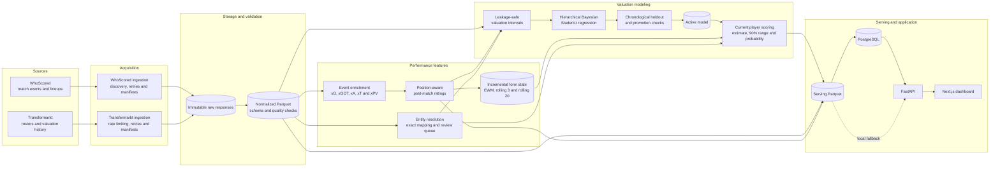
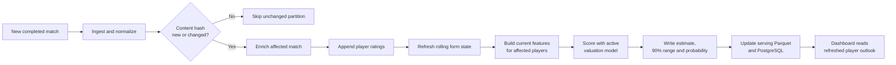

# Market Value Pulse architecture

## End-to-end system

## Incremental update path

A completed match is the unit of incremental work. Content hashes make retries
idempotent, unchanged partitions are skipped, and only affected player state and
forecasts need to be refreshed.
