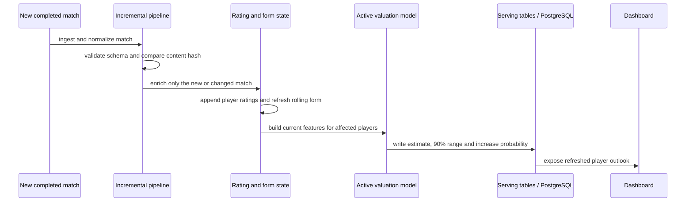

# Market Value Pulse Architecture

This diagram summarizes the end-to-end data flow from acquisition through model scoring and the dashboard.

```mermaid
flowchart LR
    subgraph Sources[Open football sources]
        WS[WhoScored match pages<br/>events, lineups, minutes]
        TM[Transfermarkt<br/>rosters and valuation history]
    end

    subgraph Acquisition[Incremental acquisition]
        WSI[WhoScored ingestor<br/>rate limits, retries, manifests]
        TMI[Transfermarkt ingestor<br/>rate limits, retries, manifests]
    end

    subgraph Storage[Immutable and normalized storage]
        RAW[(data/raw<br/>immutable source evidence)]
        NORM[(data/normalized<br/>validated Parquet partitions)]
    end

    subgraph Features[Feature and rating layer]
        ENRICH[xG, xGOT, xA, xT, xPV<br/>progression and defensive value]
        RATINGS[Position-aware post-match ratings]
        STATE[(Incremental state<br/>hashes, EWM, rolling 3 and 20)]
        MAP[WhoScored ↔ Transfermarkt<br/>entity resolution and review queue]
    end

    subgraph Modeling[Valuation modeling]
        TRAIN[Leakage-safe valuation intervals]
        BAYES[Hierarchical Bayesian Student-t model<br/>position, age, form and player effects]
        GATES[Chronological holdout<br/>promotion quality gates]
        ACTIVE[(Versioned active model)]
        SCORE[Current scoring<br/>midpoint, 90% range and increase probability]
    end

    subgraph Serving[Serving and application]
        PARQUET[(Canonical serving Parquets)]
        PG[(PostgreSQL)]
        API[FastAPI]
        UI[Next.js dashboard]
    end

    WS --> WSI --> RAW
    TM --> TMI --> RAW
    RAW --> NORM
    NORM --> ENRICH --> RATINGS
    RATINGS --> STATE
    NORM --> MAP
    RATINGS --> TRAIN
    MAP --> TRAIN
    NORM --> TRAIN
    TRAIN --> BAYES --> GATES --> ACTIVE
    ACTIVE --> SCORE
    STATE --> SCORE
    MAP --> SCORE
    SCORE --> PARQUET
    NORM --> PARQUET
    RATINGS --> PARQUET
    PARQUET --> PG --> API --> UI
    PARQUET -. local fallback .-> API
```

## Continuous-update path

The architecture is intentionally batch-incremental rather than stream-heavy. A completed match is the unit of work, allowing idempotent retries, deterministic replay and affected-player rescoring without rebuilding all historical data.
